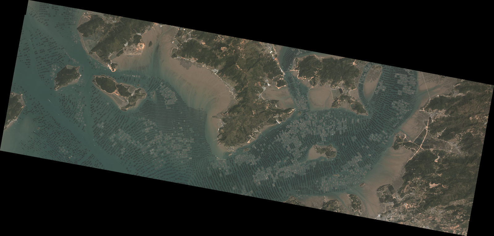
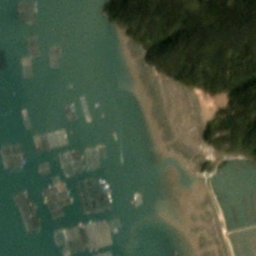
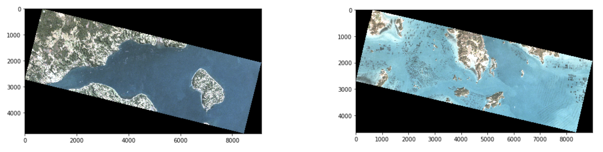

# Detecting Aquaculture in Satellite Imagery

This repository contains Python scripts and notebooks for processing satellite images. The processed images are subsequently used for training a deep learning model (Mask R-CNN) to detect aquaculture farms in satellite imagery.

## Data

The data for this project are [PlanetScope Analytic SR Basic](https://www.planet.com/products/satellite-imagery/files/1610.06_Spec%20Sheet_Combined_Imagery_Product_Letter_ENGv1.pdf) satellite (GeoTiff) images from Planet Labs Inc. All images have a three meter ground sample distance and four spectral bands (B,G,R,NIR). Images are not stored in the repository.

### Notebooks

1. `process_planet_scenes.ipynb` - Contains code for numerous processing steps developed in other notebooks. Takes original directories of image orders from Planet and, for each image in the order, generates directories of paired image chips in GeoTiff and PNG formats. Also contains code to process VGG labeling projects. 

2. `planet_tiff2tiles.ipynb` - Processes PlanetScope 4-band GeoTiff images and generates directories of paired image chips in GeoTiff and PNG formats

  

3. `visualization_testing.ipynb` - Tests various methods of color correction for converting the raw 16-bit GeoTiffs to RGB images suitable for annotation

4. `planet_api_intro.ipynb` - Connects to the Planet API and checks status of monthly quota usage

5. `create_mask_instances.ipynb` - Creates instance-specific masks for every aquaculture object in a class-specific mask. Code no longer used and masks are created during dataset creation in TensorFlow

6. `chip_labeled_planet.ipynb` - Processes two PlanetScope scenes that contain extra bands representing class-specific masks and generates directories of image chips with class-specific create_mask_instances. Code no longer part of workflow.
